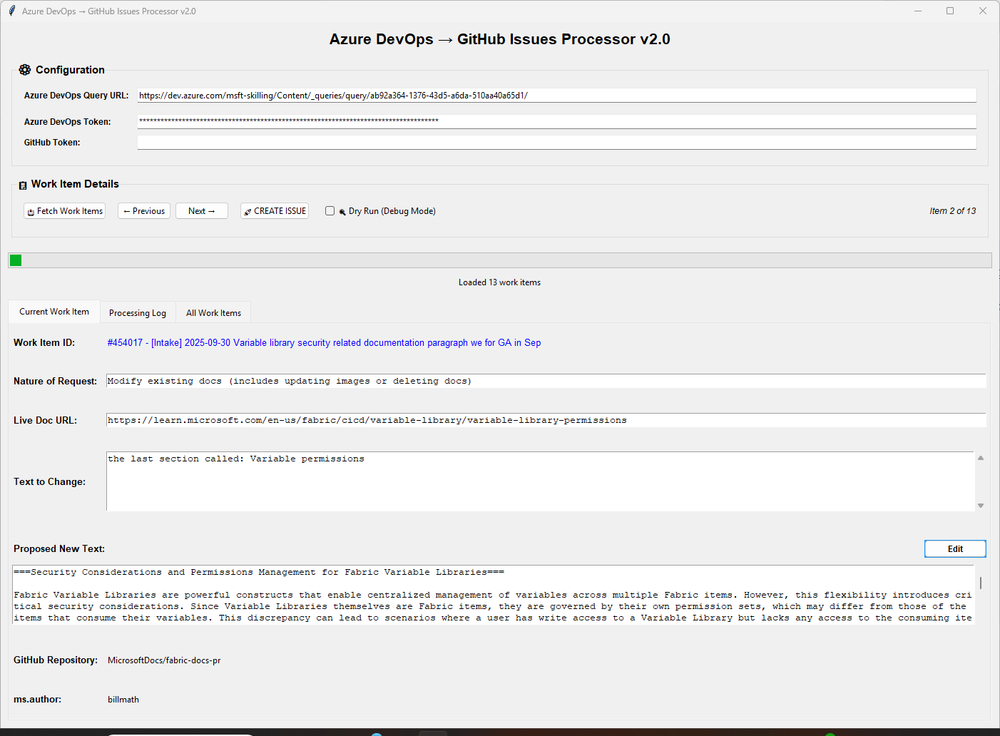
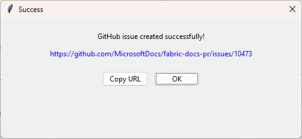
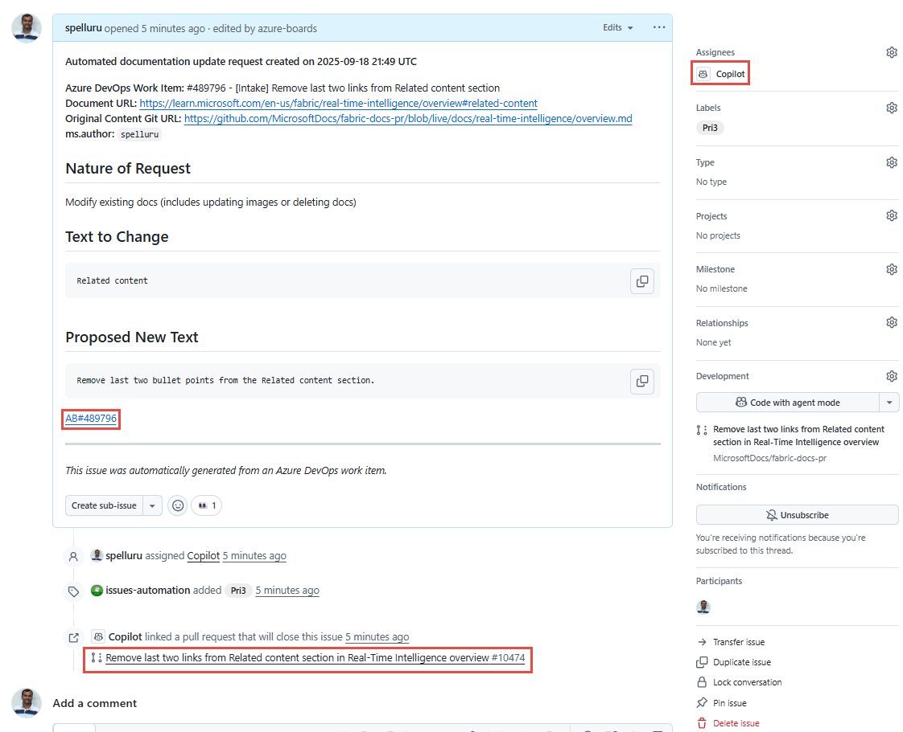
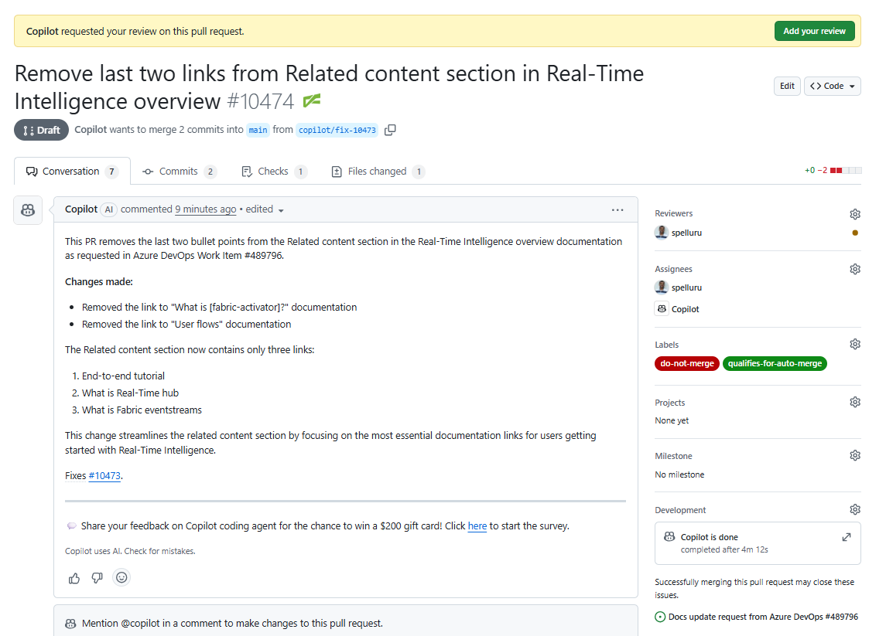

# Azure DevOps → GitHub Processor (GUI)

Azure DevOps -> GitHub Processor is a small, focused GUI tool that you can use to perform the following tasks: 

1. Fetches Azure DevOps work items using a query you specify and extracts documentation change information from them.
1. Creates a GitHub issues using the information and assigns the issue to GitHub Copilot, which analyzes the request, creates a branch, updates the article to fix the issue, and submits a pull request (PR) on behalf of you. 

    The following diagram shows you the high-level steps performed by this solution: 

    

    The PR is assigned to the author of the article based on the author metadata in the article. The author reviews off the PR and signs on it if the changes done by Copilot look good. 

The `devops_to_github.py` file in the `Devops_to_GitHub_Python/latest` folder has all the code behind this tool.

## Prerequisites
Here are the prerequisites to use the tool: 

- Python 3.10 or newer (the code uses modern union types like `dict | None`)
- Install packages used in the code, such as `requests` and `tkinter`, which is used for the GUI. 
- GitHub Copilot must be enabled at the organization level or for the specific repository.
- You must have admin access to the repository to assign issues to Copilot.

### Azure DevOps prerequisites 

- **Azure DevOps Query URL**: A shared query URL containing documentation update work items. You can use this [sample query](https://dev.azure.com/msft-skilling/Content/_queries/query/ab92a364-1376-43d5-a6da-510aa40a65d1/) for testing purposes.

    Work items must contain the following fields in their description:

    - **Nature of Request**: Must include **Modify existing docs**.
    - **Link to doc**: Must be a URL to a Learn article. 
    - **Text to change**: Current text that needs to update. Can be blank.
    - **Proposed new text**: Suggested replacement text. This text can be instructional such as "Remove last two links from the Related content section". In this example, the GitHub Copilot doesn't replace old text with new text. It just removes those two links. 
- **Azure DevOps Personal Access Token (PAT)**: Token with work item read, write, and manage permissions. The write permission is used to write back the link to GitHub issue in the DevOps work item. For instructions on creating a token, see [Authenticate to DevOps with personal access tokens](https://learn.microsoft.com/azure/devops/organizations/accounts/use-personal-access-tokens-to-authenticate?view=azure-devops&tabs=Windows#create-a-pat).

### GitHub prerequisites
- **GitHub Personal Access Token**: A **classic** token with **repo**, **admin:org**, and **copilot** permissions. For instructions on creating a token, see [Create a personal access token (classic)](https://docs.github.com/authentication/keeping-your-account-and-data-secure/managing-your-personal-access-tokens#creating-a-personal-access-token-classic)

## Configuration and tokens management
The app first looks for tokens in the **launch.json** file and then in the **.env** file. We recommend that you use the **.env** approach. 

Create a `.env` file in the repository root and add:

```
AZURE_DEVOPS_QUERY=your_azure-devops-query-url
AZURE_DEVOPS_PAT=your_azure_devops_pat_here
GITHUB_PAT=your_github_pat_here
```

**Security reminder**: Never commit secrets. Add `.env` to `.gitignore` if you plan to store tokens locally.

### launch.json 

Create or edit `.vscode/launch.json` and add the values into the `env` object for the configuration you run. Example snippet:

```json
{
  "configurations": [
    {
      "name": "Run devops_to_github",
      "type": "python",
      "request": "launch",
      "program": "${workspaceFolder}/POC/latest/devops_to_github.py",
      "console": "integratedTerminal",
      "env": {
        "AZURE_DEVOPS_QUERY": "<your-azure-devops-query-url>",
        "AZURE_DEVOPS_PAT": "<your-azure-pat>",
        "GITHUB_PAT": "<your-github-pat>"
      }
    }
  ]
}

```
- If you use a VS Code launch configuration, do NOT put secrets in `.vscode/launch.json`.
  - Instead use an env file and reference it via `"envFile": "${workspaceFolder}/.env"` or keep only placeholders in a committed `launch.json.example`.
- For CI and shared environments, use secret stores (GitHub Actions secrets, Azure Key Vault, etc.)—do not commit tokens into the repo.

**Warning:** Never commit PATs, tokens, or other secrets. If a secret is accidentally committed, rotate it immediately.

## How to run the app
Use one of the following methods: 

- From a terminal (PowerShell on Windows), run the following command: `python .\POC\latest\devops_to_github.py`
- Or run the `Run`/`Debug` configuration in VS Code if you configured `launch.json` (or) `.env`. 

## Using the app (overview)
1. Enter or verify the Azure DevOps Query URL and the PATs (or rely on loaded config from `launch.json` / `.env`).
1. Toggle **Dry Run**" to simulate operations (recommended for first runs).
1. Select **Fetch Work Items** to execute the Azure query and parse work items (this invokes `start_fetch_work_items` -> `fetch_work_items`).

    
1. Navigate items with **← Previous** / **Next →**. Each item shows the parsed fields (`nature_of_request`, `mydoc_url`, `text_to_change`, `new_text`), detected GitHub repo (owner/repo), and `ms.author` when available.
1. Edit the **proposed new text** inline by selecting the ✏️ Edit control, make changes, then **Save**.
1. Select **🚀 CREATE ISSUE** to create an issue in the detected GitHub repo. On success you will get a hyperlink dialog with the created issue URL.

    

    Here's what the tool does when you select **Create issue**
    - Uses GitHub GraphQL API to fetch the repository ID and call `createIssue`.
    - Attempts to locate a suggested actor named like Copilot and assign the new issue to that actor.
    - Includes an `AB#<work item id>` line in the issue body to trace back to the Azure work item.
    - If available, calls Azure DevOps API to add a hyperlink back to the Azure work item referencing the new GitHub issue URL.
1. Select the link to navigate to the GitHub issue to do the following tasks. In your Azure DevOps work item, you should see a link to the GitHub issue in the **GitHub issue** section as well. 
    - Review the details
    - Notice that the GitHub issue is assigned to a Copilot
    - The Copilot has created a pull request. 
    - A link back to Azure DevOps work item
    
        
1. Select the pull request to review changes, and sign off on the PR after a successful build and the changes look good to you. 

    

## Dry-run and logging
Dry-run prints GraphQL payloads and simulates the behavior without performing remote mutations. Inspect the "Processing Log" tab to see payloads and debug messages.

## Notes, limitations & troubleshooting
- The UI currently focuses on creating issues. There is a GraphQL `createPullRequest` function implemented, but the PR option is not exposed in the GUI at the moment.
- The work item description parsing is opinionated and expects fields like "Nature of Request:", "Link to Doc:", "Text to Change:", and "Proposed new text:". If parsing fails, the work item will be skipped.
- Document URL extraction relies on the document's HTML metadata (`original_content_git_url` or similar). If the metadata isn't present or the URL is not a GitHub URL, the tool cannot determine owner/repo.
- Common errors:
  - Invalid query URL: ensure the query URL uses `_queries/query/<id>/` or includes `queryId=`
  - Token permission errors: check PAT scopes
  - Network timeouts: check VPN/firewall rules and increase timeouts in code if needed

## Developer notes
- File of interest: `POC/latest/devops_to_github.py` (main GUI + logic)
- Logging is visible in the GUI under "Processing Log". The app is single-process with background threads for network calls.
- Python typing uses modern syntax (requires Python 3.10+).

## Process flow (diagram)

The following diagram illustrates the end-to-end processing flow implemented by `POC/latest/devops_to_github.py`. It shows how the application fetches Azure DevOps work items, validates and parses each item, discovers the target GitHub repository from the document metadata, and then creates and (optionally) assigns and links the resulting GitHub issue back to the Azure DevOps work item.


High-level steps shown in the diagram:

1. User launches the GUI and provides the Azure DevOps query URL and tokens.
1. The app validates the query URL and executes the query to fetch work item IDs.
1. For each work item the app fetches details and parses the description for the required fields (Nature of Request, Link to Doc, Text to Change, Proposed new text).
1. If the item contains a valid document URL, the tool requests the document HTML and extracts `original_content_git_url` and metadata such as `ms.author`.
1. The tool maps the document metadata to a GitHub `owner/repo`, builds an issue title and body, and uses the GitHub GraphQL API to create the issue (dry-run mode simulates this).
1. If available, Copilot (or another suggested actor) is assigned to the created issue; the tool will also attempt to add a hyperlink back to the Azure work item.
1. The GUI updates the item's processing status and shows a link to the created issue on success.

## Contributing

This project welcomes contributions and suggestions.  Most contributions require you to agree to a
Contributor License Agreement (CLA) declaring that you have the right to, and actually do, grant us
the rights to use your contribution. For details, visit [Contributor License Agreements](https://cla.opensource.microsoft.com).

When you submit a pull request, a CLA bot will automatically determine whether you need to provide
a CLA and decorate the PR appropriately (e.g., status check, comment). Simply follow the instructions
provided by the bot. You will only need to do this once across all repos using our CLA.

This project has adopted the [Microsoft Open Source Code of Conduct](https://opensource.microsoft.com/codeofconduct/).
For more information see the [Code of Conduct FAQ](https://opensource.microsoft.com/codeofconduct/faq/) or
contact [opencode@microsoft.com](mailto:opencode@microsoft.com) with any additional questions or comments.

## Trademarks

This project may contain trademarks or logos for projects, products, or services. Authorized use of Microsoft
trademarks or logos is subject to and must follow
[Microsoft's Trademark & Brand Guidelines](https://www.microsoft.com/legal/intellectualproperty/trademarks/usage/general).
Use of Microsoft trademarks or logos in modified versions of this project must not cause confusion or imply Microsoft sponsorship.
Any use of third-party trademarks or logos are subject to those third-party's policies.
