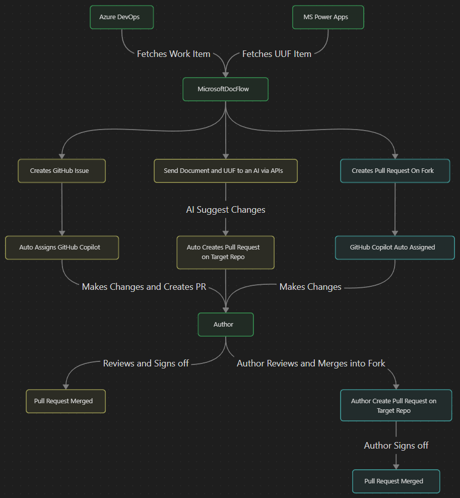

A Python-based GUI application for GitHub automation workflows and AI assisted workflows.

> [!NOTE]
> This project is currently in active development. Features and functionality may change frequently. Bug reports and contributions are welcome and encouraged!
> Please be aware that some features may be incomplete or unstable.


## Pulse Workflow



## Project Structure

```text
github_pulse/
├── application/              # Main application directory
│   ├── app.py               # Application entry point
│   ├── requirements.txt     # Python dependencies
│   └── app_components/      # Application modules
│       ├── __init__.py          # Package initializer
│       ├── ai_manager.py           # AI provider integration
│       ├── cache_manager.py        # Caching functionality
│       ├── config_manager.py       # Configuration management
│       ├── github_api.py           # GitHub API client
│       ├── main_gui.py             # Main GUI interface
│       ├── processing_log_dialog.py  # Processing log dialog
│       ├── settings_dialog.py      # Settings dialog
│       ├── settings_manager.py     # Settings management
│       ├── utils.py                # Utility functions
│       └── workflow.py             # Workflow processing
├── media/                   # Images and assets
├── README.md               # This file
├── SETUP.md                # Setup guide
└── LICENSE                 # License information
```

## Prerequisites

- Python 3.8 or higher
- Git installed and configured
- GitHub account with repository access

## Quick Start

1. **Clone the repository**
   ```bash
   git clone https://github.com/TySP-Dev/github_pulse.git
   cd github_pulse/application
   ```

2. **Create and activate virtual environment**
   ```bash
   # Create virtual environment
   python -m venv venv

   # Activate (Windows)
   venv\Scripts\activate

   # Activate (macOS/Linux)
   source venv/bin/activate
   ```

3. **Install dependencies**
   ```bash
   pip install -r requirements.txt
   ```

4. **Run the application**
   ```bash
   python app.py
   ```

## Configuration

Configuration is managed through a `.env` file or settings dialog in the application.

See [SETUP.md](SETUP.md) for detailed setup instructions.

## Contributing

This project welcomes contributions and suggestions. In order to contribute, please fork the repository and create a pull request.

## License

GNU General Public License v3.0.
See [LICENSE](LICENSE) file for details.
